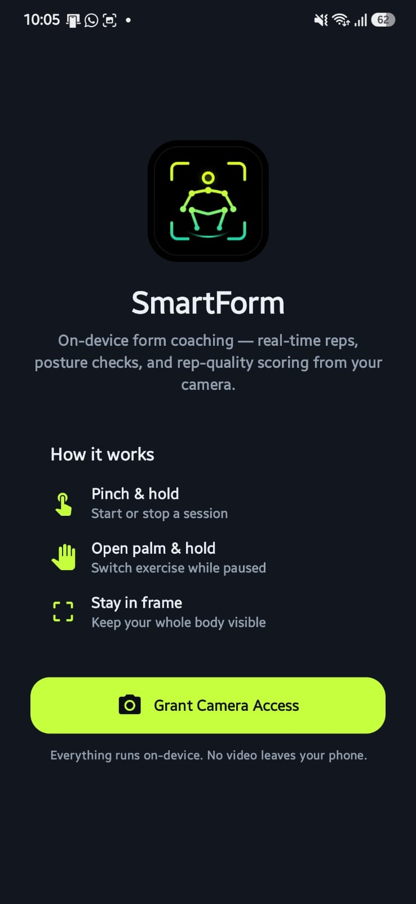
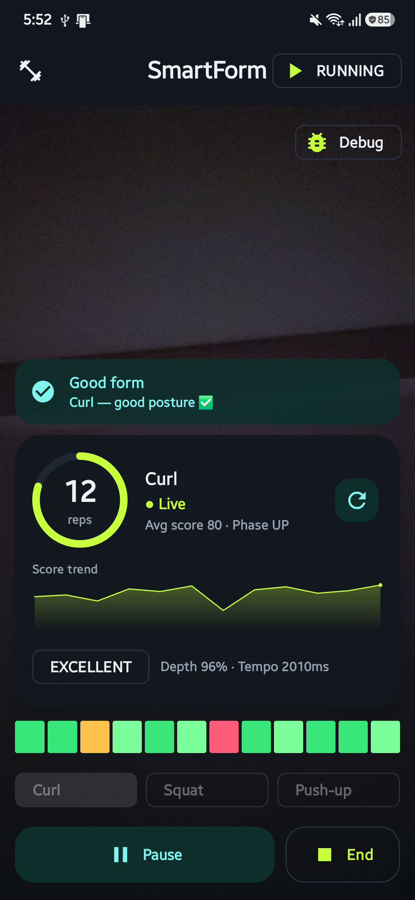
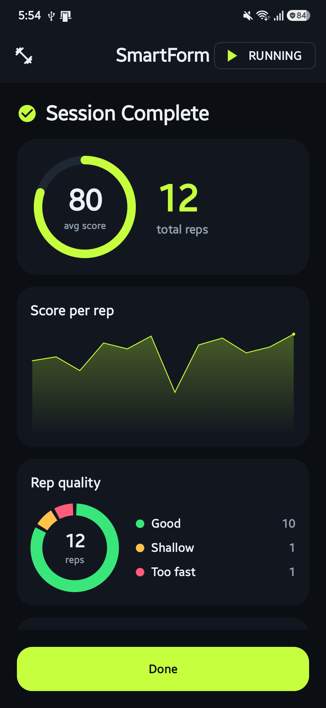
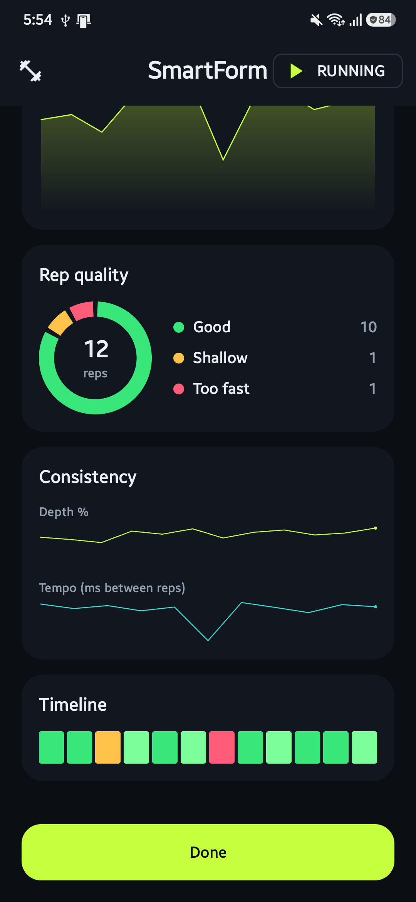

# SmartForm

[](https://github.com/atikulmunna/SmartForm/releases/latest/download/SmartForm-arm64-v8a.apk)
[](https://smartform.en.uptodown.com/android)

SmartForm is an Android fitness app that performs on-device pose detection and hand tracking to help users train with better form, count reps, and control the experience hands-free with gestures. It is built fully on-device with CameraX, ML Kit, MediaPipe, and Jetpack Compose.

It currently supports guided tracking for **curls, squats, and push-ups**, with posture-aware rep counting, per-exercise calibration, rep-quality scoring, and a graph-driven session summary — all wrapped in a dark, athletic "neon" UI.

## Download

Grab the APK for your device from the [latest release](https://github.com/atikulmunna/SmartForm/releases/latest):

| Variant | Devices | Size |
|---|---|---|
| [**arm64-v8a**](https://github.com/atikulmunna/SmartForm/releases/latest/download/SmartForm-arm64-v8a.apk) | Recommended — all modern phones (2017+) | ~45 MB |
| [armeabi-v7a](https://github.com/atikulmunna/SmartForm/releases/latest/download/SmartForm-armeabi-v7a.apk) | Older 32-bit devices | ~36 MB |
| [universal](https://github.com/atikulmunna/SmartForm/releases/latest/download/SmartForm-universal.apk) | Works on any device | ~130 MB |

Requires Android 8.0 (API 26)+. Also available on Uptodown:

<a href="https://smartform.en.uptodown.com/android" title="Download SmartForm">
  
</a>

## Screenshots

| Onboarding | Live workout HUD | Session summary | Session breakdown |
|---|---|---|---|
|  |  |  |  |

## Overview

SmartForm combines three capabilities in a single camera pipeline:

- Real-time body pose detection for exercise analysis
- Real-time hand landmark tracking for gesture input
- Live rep counting and form evaluation for supported exercises

The experience is designed around a hands-free workout loop:

1. Grant camera access
2. Choose an exercise mode (gesture or on-screen)
3. Start a session (pinch gesture or on-screen button)
4. Perform reps while SmartForm evaluates posture and rep quality
5. End the session and review the graph-based summary

## Features

### Real-time pose tracking
- Full-body pose detection using ML Kit Pose Detection
- Live skeleton overlay aligned to the camera preview
- Continuous, backpressure-limited frame processing tuned for on-device use

### Hand tracking and gesture control
- 21-point hand landmark detection using MediaPipe Tasks
- Debounced, hold-based gestures to reduce accidental triggers
  - `Pinch-hold` — start / stop a session (or capture a calibration pose)
  - `Open-palm-hold` — switch exercise mode while paused
- **On-screen controls** (Start/Pause, End, mode selector) fully mirror the gestures, so the app stays usable if hand tracking is unavailable

### Exercise modes
Bicep curls, squats, and push-ups — each with its own rep thresholds and independent calibration. Push-up mode shows an in-app hint to place the phone to your side (front-camera pose tracking of a plank is unreliable).

### Form-gated rep counting
- Tracks rep phases and counts completed reps in real time
- **Posture gating is phase-independent** — it checks stability/visibility that holds across a rep (body in frame, level, torso not swinging), so counting is never paused mid-rep by the movement itself
- Low-quality movement doesn't get credited as a valid rep

### Rep-quality feedback
- Direction-agnostic depth model (correct for curls, squats, and push-ups)
- Flags shallow reps and overly fast reps, with a per-rep score
- Maintains a recent rep timeline and a running average session score

### Calibration
- Per-exercise calibration adapts thresholds to the user
- Stored locally with DataStore; reset-to-defaults supported

### Session summary (graphs)
A scrollable dashboard rendered with hand-drawn Compose-Canvas charts:
- Average-score ring + total reps hero
- Score-per-rep line/area chart
- Verdict donut (good / shallow / too-fast) with legend
- Depth % and tempo small-multiple sparklines
- Full rep-quality timeline

### Onboarding & developer tools
- First-run screen with a gesture how-to and on-device privacy note
- Built-in debug panel for inspecting thresholds, angles, posture, and calibration

## Architecture

SmartForm uses a state-driven Compose UI backed by a `ViewModel`:

- **`SessionViewModel`** owns all in-session state (rep counting, posture, quality/session tallies, calibration) and exposes an immutable `SessionUiState`. It survives configuration changes and persists the selected mode via `SavedStateHandle`. Camera frames are fed in by plain method calls; hand frames land in a thread-safe `StateFlow` (they arrive on a background analyzer thread).
- **`SessionTracker`** is a pure, Android-free accumulator for per-session rep quality — unit-tested on the host JVM.
- **`RepCounter`** is a hysteresis + confirm-frame + EMA state machine with an injectable clock, so its transitions are deterministically testable.
- **`PoseMath`** holds the shared joint-angle geometry used by rep counting and posture evaluation.
- **Frame pipeline:** CameraX drives two `ImageAnalysis` use-cases on separate single-thread executors — `PoseProcessor` (ML Kit, YUV) and `HandProcessor` (MediaPipe, RGBA) — with `STRATEGY_KEEP_ONLY_LATEST` backpressure. Model initialization fails gracefully (a missing/corrupt hand model disables gestures instead of crashing).
- **Charts** are drawn by hand with Compose `Canvas` (`ui/charts/`) — no external charting dependency, fully theme-aware.

## Tech stack

- Language: Kotlin
- UI: Jetpack Compose (Material 3), committed dark "neon" theme
- Architecture: MVVM (`ViewModel` + immutable UI state) with pure, testable domain logic
- Camera: CameraX
- Pose detection: ML Kit Pose Detection
- Hand tracking: MediaPipe Tasks Vision
- Local storage: DataStore Preferences
- Testing: JUnit (host-JVM unit tests)

## Project structure

```text
app/src/main/java/com/app/smartform/
├── calibration/
│   ├── CalibrationModels.kt
│   └── CalibrationStore.kt
├── camera/
│   └── CameraPreview.kt
├── gesture/
│   └── GestureDetector.kt
├── hand/
│   ├── HandModels.kt
│   ├── HandOverlay.kt
│   ├── HandProcessor.kt
│   └── YuvToRgbConverter.kt
├── pose/
│   ├── PoseFrame.kt
│   ├── PoseMath.kt
│   ├── PoseProcessor.kt
│   ├── PostureEvaluator.kt
│   └── SkeletonOverlay.kt
├── reps/
│   ├── ExerciseMode.kt
│   ├── RepCounter.kt
│   ├── RepQuality.kt
│   └── RepThresholds.kt
├── session/
│   ├── SessionStats.kt
│   ├── SessionTracker.kt
│   └── SessionViewModel.kt
├── ui/
│   ├── SessionSummaryScreen.kt
│   ├── charts/Charts.kt
│   └── theme/ (Color.kt, Theme.kt, Type.kt)
└── MainActivity.kt
```

## Testing

Domain logic is covered by host-JVM unit tests:

```bash
./gradlew :app:testDebugUnitTest
```

- `RepCounterTest` — down/up transitions, hysteresis, form-gating, reset, arm selection
- `RepQualityEvaluatorTest` — depth %, verdicts, tempo thresholds, curl (inverted-threshold) depth
- `SessionTrackerTest` — verdict tallies, average score, timeline cap, snapshot
- `PoseMathTest` — joint-angle geometry
- `CalibrationProfileTest` — default thresholds

## Requirements

- Android Studio with a current Android SDK (platforms 35+)
- Java 17+
- An Android device with a working camera (an emulator is not reliable for pose/hand validation)

## Build and run

```bash
./gradlew :app:installDebug
```

Clean reinstall:

```bash
./gradlew :app:uninstallDebug
./gradlew :app:installDebug
```

## Building a signed release

Release signing reads credentials from a **git-ignored** `keystore.properties` at the project root:

```properties
storeFile=/path/to/your.keystore
storePassword=********
keyAlias=********
keyPassword=********
```

Then:

```bash
./gradlew :app:assembleRelease
```

Notes:
- The `release` build type enables R8 minification and resource shrinking, with keep rules for ML Kit / MediaPipe (`app/proguard-rules.pro`).
- If `keystore.properties` is absent, release falls back to the debug key so local test builds still work.
- The output is a *universal* APK bundling native libraries for all ABIs, so it is large (~130 MB). This is fine for Uptodown; ABI splits can shrink it if needed.

## Android configuration

- Min SDK: 26
- Target SDK: 35
- Compile SDK: 35
- Version: 1.0

Required permission:

```xml
<uses-permission android:name="android.permission.CAMERA" />
```

The MediaPipe hand-landmark asset lives at `app/src/main/assets/hand_landmarker.task`.

## Limitations

- Gesture accuracy is best when the user is clearly visible and centered
- Very close distances reduce hand-landmark stability
- Low light reduces both pose and hand detection quality
- Push-ups are unreliable from a front camera; place the phone to your side
- The release APK is not yet 16 KB page-size compliant (a Google Play requirement for updates targeting Android 15+); it is unaffected on current devices and for Uptodown distribution

## Troubleshooting

- **Camera preview doesn't start** — confirm camera permission, test on a physical device
- **Gestures not recognized** — keep the hand in frame, improve lighting, hold the gesture steadily; on-screen buttons always work as a fallback
- **Reps not counting** — check the form banner, make sure the selected mode matches the movement, or run calibration
- **Calibration feels off** — reset to defaults and recapture clean top/bottom poses

## Roadmap

- Richer coaching cues during active reps
- Session history and trends across workouts
- Side-camera support for push-ups
- 16 KB page-size compliance for Play distribution
- Additional exercise modes and exportable summaries

## Contributing

SmartForm is still evolving. Contributions that improve detection quality, exercise logic, UI clarity, performance, and documentation are welcome.
